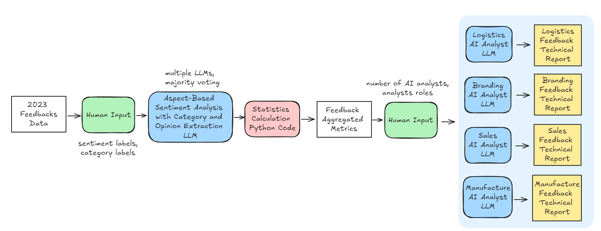

# multi-agent-customer-feedback-analysis
A multi-agent system utilizing LLMs to create an intelligent chatbot that processes customer feedback and generates detailed reports from the analysis.

# Solution

We can divide the final solution into three major components. Below is a high-level overview of the final solution architecture.



**1. Aspect-based Sentiment Analysis with Category and Opinion Extraction LLM**


**2. Statistics Calculation**


**3. Role-playing AI Analysts Reports**


# Development

### Depencies
Make sure you have python3.11 and python3.11-venv installed on your machine.

Start by cloning this repo:
```bash
$ git clone https://github.com/gabrieltardochi/multi-agent-customer-feedback-analysis.git
```

Now, create a virtual environment:
```bash
$ python3 -m venv .venv
```

Activate this venv:
```bash
$ source .venv/bin/activate
```

Intall dependencies:
```bash
$ pip install -r requirements.txt
```

### Making changes
We are using `pre-commit` to guarantee some level of quality within the codebase.

Whenever you have unstaged/staged changes that you want to commit, run:
```bash
$ python3 -m pre_commit run --files *
```

If `pre-commit` checks passes, you can consider yourself ready to commit your changes.
